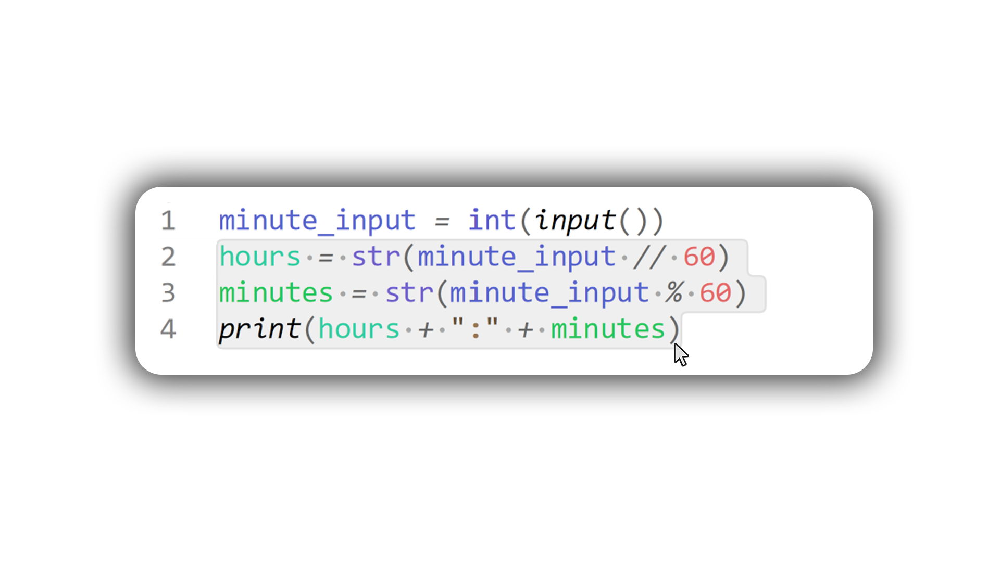

# Welcome!
Here you will find repl.it c0de! :smiley:

All of the C0de should work perfectly! :yum:	

## Instructions
1. Find the lesson (by lesson # or name) and open it.
- Some code will be placed in folders.
- Click on it and you will find the code inside.
- Select **ALL** of the code you **NEED**.


```
[Ctrl] + C
[Ctrl] + V
```
2. ^^ Copy and paste
3. Profit :heart_eyes:

## Requests
Just make an issue and I'll add in whatever code

## Disclaimer
I am __not__ associated with any people who misuse this code. 

I recommend going through the code before copying. :unamused:
